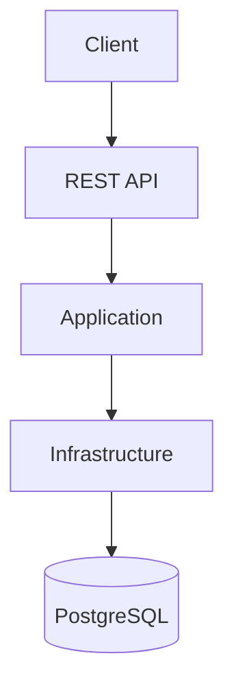

# Helpdesk Ticket Management API


ASP.NET Core 8 Web API for managing helpdesk tickets with JWT authentication, role-based authorization, comments, file attachments, optional email notification hooks, Swagger, PostgreSQL, EF Core, Docker, and a Clean Architecture project layout.

## Live Demo

Swagger Documentation

https://helpdesk-ticket-management-api.onrender.com/swagger

## Features

- JWT authentication with secure password hashing.
- Role-based access control for `Admin`, `Agent`, and `User`.
- User registration, login, and current profile endpoint.
- Admin-only user management for creating agents and admins.
- Ticket creation, listing, details, and updates.
- Ticket assignment to agents.
- Ticket status workflow: `Open`, `InProgress`, `Resolved`, and `Closed`.
- Ticket comments for collaboration.
- File attachment upload and download.
- Dashboard API with ticket totals, status counts, priority counts, and recent tickets.
- Optional email notification hook using a logging-based implementation.
- Swagger/OpenAPI documentation with Bearer token support.
- PostgreSQL persistence with Entity Framework Core.
- Docker and Docker Compose support.

## Architecture

Architecture image will be added later.



The solution follows Clean Architecture principles. Domain contains the core entities and enums, Application contains DTOs and contracts, Infrastructure implements persistence and external services, and Api exposes the HTTP endpoints.

## Projects

- `HelpdeskTicketManagement.Domain` - entities and enums.
- `HelpdeskTicketManagement.Application` - DTOs and application contracts.
- `HelpdeskTicketManagement.Infrastructure` - EF Core PostgreSQL, JWT, password hashing, local file storage, and notification services.
- `HelpdeskTicketManagement.Api` - controllers, authentication, Swagger, and startup.

## Default Accounts

The API seeds an admin account on startup when `SeedAdmin:Enabled` is `true`.

- Email: `admin@helpdesk.local`
- Password: `Admin123!`

Change these values before using the API outside local development.

## Run With Docker

```bash
docker compose up --build
```

Swagger will be available at:

```text
http://localhost:8080/swagger
```

## Run Locally

Start PostgreSQL locally, update `src/HelpdeskTicketManagement.Api/appsettings.json` if needed, then run:

```bash
dotnet run --project src/HelpdeskTicketManagement.Api/HelpdeskTicketManagement.Api.csproj
```

Swagger will be available at:

```text
http://localhost:5080/swagger
```

## Main Endpoints

- `POST /api/auth/register` - register a normal user.
- `POST /api/auth/login` - get a JWT.
- `GET /api/auth/me` - get the current user profile.
- `GET /api/users?role=Agent` - list users by role as an admin.
- `POST /api/users` - create an admin, agent, or user as an admin.
- `GET /api/tickets` - list tickets scoped by role.
- `POST /api/tickets` - create a ticket.
- `GET /api/tickets/{id}` - get a ticket.
- `PUT /api/tickets/{id}` - update ticket details.
- `POST /api/tickets/{id}/assign` - assign a ticket to an agent.
- `PATCH /api/tickets/{id}/status` - update status.
- `POST /api/tickets/{id}/comments` - add a comment.
- `POST /api/tickets/{id}/attachments` - upload an attachment as multipart form data with field name `file`.
- `GET /api/tickets/{id}/attachments/{attachmentId}` - download an attachment.
- `GET /api/dashboard` - dashboard totals and recent tickets.

## Screenshots

### Swagger UI


## Roles

- `Admin` can see and manage all tickets.
- `Agent` can see unassigned tickets, tickets assigned to them, and tickets they created.
- `User` can see and manage tickets they created.

## Roadmap

- Add Entity Framework Core migrations for production database changes.
- Add automated tests for authentication, ticket workflow, and dashboard endpoints.
- Replace logging email sender with SMTP or a cloud email provider.
- Add refresh tokens and token revocation.
- Add ticket category and SLA tracking.
- Add audit trail for ticket assignment and status changes.
- Add production deployment and live demo link.
