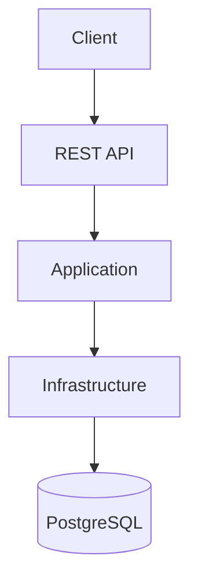
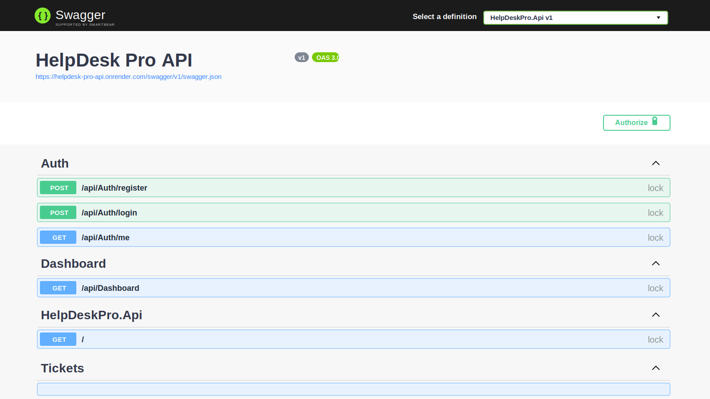

# 🚀 HelpDesk Pro API

Enterprise Helpdesk Ticket Management REST API built with ASP.NET Core 8, PostgreSQL, Docker, JWT Authentication, Swagger, and Clean Architecture.


## 🌐 Live Demo

Swagger Documentation:  
https://helpdesk-ticket-management-api.onrender.com/swagger/index.html

## 📌 Overview

HelpDesk Pro API is a production-style backend system for managing customer support tickets.

It supports secure authentication, role-based authorization, ticket assignment, ticket comments, file attachments, dashboard statistics, and API documentation through Swagger.

This project demonstrates enterprise backend development practices using ASP.NET Core 8, Entity Framework Core, PostgreSQL, Docker, and Clean Architecture.

## Features

- JWT authentication with secure password hashing.
- Refresh token rotation and revocation.
- Role-based access control for `Admin`, `Agent`, and `User`.
- User registration, login, and current profile endpoint.
- Admin-only user management for creating agents and admins.
- Ticket creation, listing, details, and updates.
- Ticket assignment to agents.
- Ticket status workflow: `Open`, `InProgress`, `Resolved`, and `Closed`.
- Ticket comments for collaboration.
- File attachment upload and download.
- SLA tracking with response and resolution deadlines.
- Audit trail for authentication, user, ticket, comment, and attachment events.
- Dashboard API with ticket totals, status counts, priority counts, and recent tickets.
- SMTP email notifications with logging fallback when SMTP is disabled.
- Automated tests for security and SLA behavior.
- Swagger/OpenAPI documentation with Bearer token support.
- PostgreSQL persistence with Entity Framework Core.
- Docker and Docker Compose support.

## Architecture

Architecture image will be added later.



The solution follows Clean Architecture principles. Domain contains the core entities and enums, Application contains DTOs and contracts, Infrastructure implements persistence and external services, and Api exposes the HTTP endpoints.

## Projects

- `HelpDeskPro.Domain` - entities and enums.
- `HelpDeskPro.Application` - DTOs and application contracts.
- `HelpDeskPro.Infrastructure` - EF Core PostgreSQL, JWT, password hashing, local file storage, and notification services.
- `HelpDeskPro.Api` - controllers, authentication, Swagger, and startup.

## Default Accounts

The API seeds an admin account on startup when `SeedAdmin:Enabled` is `true`.

- Email: `admin@helpdesk.local`
- Password: `Admin123!`

Change these values before using the API outside local development.

## Requirements

- .NET 8 SDK
- Docker
- PostgreSQL

## Run With Docker

```bash
docker compose up --build
```

Swagger will be available at:

```text
http://localhost:8080/swagger
```

## Run Locally

Start PostgreSQL locally, update `src/HelpDeskPro.Api/appsettings.json` if needed, then run:

```bash
dotnet run --project src/HelpDeskPro.Api/HelpDeskPro.Api.csproj
```

Swagger will be available at:

```text
http://localhost:5080/swagger
```

## Main Endpoints

- `POST /api/auth/register` - register a normal user.
- `POST /api/auth/login` - get a JWT.
- `POST /api/auth/refresh` - rotate a refresh token and get a new JWT.
- `POST /api/auth/revoke` - revoke a refresh token.
- `GET /api/auth/me` - get the current user profile.
- `GET /api/users?role=Agent` - list users by role as an admin.
- `POST /api/users` - create an admin, agent, or user as an admin.
- `GET /api/tickets` - list tickets scoped by role. Supports `status`, `assignedToMe`, `createdByMe`, `slaBreached`, and `slaDueWithinHours` filters.
- `POST /api/tickets` - create a ticket.
- `GET /api/tickets/{id}` - get a ticket.
- `PUT /api/tickets/{id}` - update ticket details.
- `POST /api/tickets/{id}/assign` - assign a ticket to an agent.
- `PATCH /api/tickets/{id}/status` - update status.
- `POST /api/tickets/{id}/comments` - add a comment.
- `POST /api/tickets/{id}/attachments` - upload an attachment as multipart form data with field name `file`.
- `GET /api/tickets/{id}/attachments/{attachmentId}` - download an attachment.
- `GET /api/dashboard` - dashboard totals and recent tickets.
- `GET /api/audit-logs` - view audit trail entries as an admin.

## Configuration Notes

- `RefreshTokens:ExpirationDays` controls refresh token lifetime.
- `Smtp:Enabled` enables SMTP delivery. When disabled, notification attempts are logged instead.
- `Smtp:Host`, `Smtp:Port`, `Smtp:UseSsl`, `Smtp:UserName`, `Smtp:Password`, `Smtp:FromEmail`, and `Smtp:FromName` configure email delivery.

## Tests

```bash
dotnet test HelpDeskPro.sln
```

## Screenshots

### Swagger UI



## Roles

- `Admin` can see and manage all tickets.
- `Agent` can see unassigned tickets, tickets assigned to them, and tickets they created.
- `User` can see and manage tickets they created.

## Roadmap

- [x] JWT Authentication
- [x] Role Based Authorization
- [x] Ticket Management
- [x] Ticket Comments
- [x] File Attachments
- [x] Dashboard API
- [x] PostgreSQL Integration
- [x] Docker Support
- [x] Live Deployment
- [x] Automated Tests
- [x] Refresh Tokens
- [x] Audit Trail
- [x] SMTP Email Notifications
- [x] SLA Tracking

## License

This project is licensed under the MIT License.
